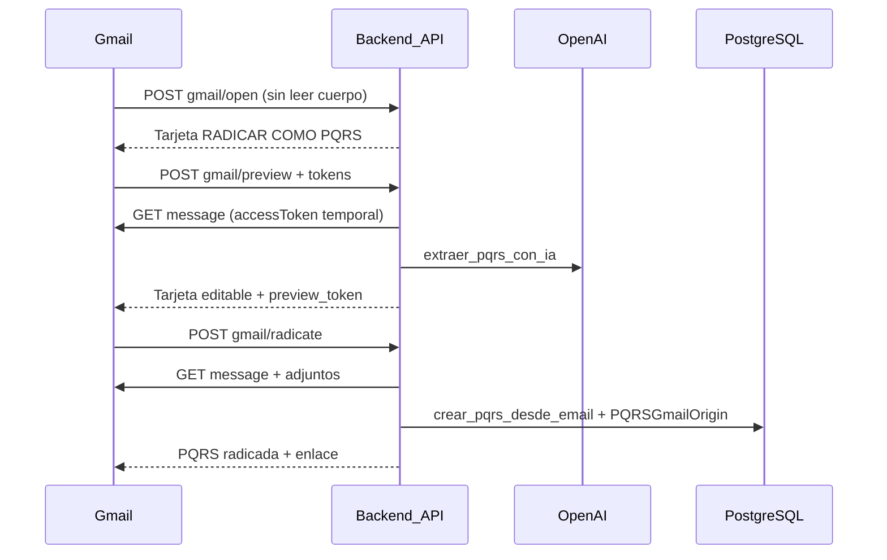

# Integración Gmail — PQRS (Add-on + OAuth)

Esta integración **coexiste** con el ingreso IMAP (`ingest_pqrs_inbox`) y el envío ZeptoMail existente. No los reemplaza.

## Componentes

| Componente | Descripción |
|---|---|
| **Gmail Add-on (HTTP)** | Radicar el correo abierto como PQRS con vista previa IA editable |
| **OAuth `gmail.send`** | Cada funcionario conecta su Gmail institucional para enviar respuestas |
| **ZeptoMail / IMAP** | Siguen activos si Gmail no está conectado o para ingreso por reenvío |

## Scopes (mínimo privilegio)

**Add-on (funcionario en Gmail):**

- `https://www.googleapis.com/auth/gmail.addons.execute`
- `https://www.googleapis.com/auth/gmail.addons.current.message.action`
- `https://www.googleapis.com/auth/userinfo.email`

No se usan `gmail.readonly`, `gmail.modify` ni `mail.google.com`.

**OAuth envío (app web):**

- `https://www.googleapis.com/auth/gmail.send`
- `https://www.googleapis.com/auth/userinfo.email`

## Google Cloud — configuración

1. Crear proyecto (o usar existente) en [Google Cloud Console](https://console.cloud.google.com/).
2. Habilitar **Gmail API**.
3. Pantalla de consentimiento OAuth (interno Workspace si aplica).
4. Credenciales:
   - **OAuth client (Web)** → `GOOGLE_CLIENT_ID` / `GOOGLE_CLIENT_SECRET`
   - **OAuth client (Add-on)** → `GOOGLE_ADDON_CLIENT_ID` (audience de tokens del add-on)
5. URI de redirección autorizada:
   - Demo: `https://demo.softone360.com/api/v1/integrations/google/callback`
   - Prod: `https://app.softone360.com/api/v1/integrations/google/callback`

## Workspace Add-on HTTP

Manifiesto: [`deploy/google-addon/deployment.json`](../deploy/google-addon/deployment.json)

Ajuste `httpOptions.rootUrl` al entorno:

- Demo: `https://demo.softone360.com/api/v1/google-addon`
- Prod: `https://app.softone360.com/api/v1/google-addon`

Endpoints (POST):

| Función | URL |
|---|---|
| Abrir tarjeta | `/gmail/open` |
| Vista previa IA | `/gmail/preview` |
| Radicar | `/gmail/radicate` |

Despliegue del add-on (CLI Google):

```bash
# Requiere clasp / gcloud según su flujo Workspace
# Subir deployment.json y publicar en prueba interna o Marketplace
```

### Instalación de prueba

1. Admin Workspace → Apps → Google Workspace Marketplace → Add-ons internos.
2. Desplegar versión de prueba apuntando al `rootUrl` de demo.
3. Asignar add-on a usuarios `@*.gov.co` de prueba.
4. Abrir un correo en Gmail → panel del add-on → **RADICAR COMO PQRS**.

## Variables de entorno

```env
GOOGLE_CLIENT_ID=
GOOGLE_CLIENT_SECRET=
GOOGLE_REDIRECT_URI=https://demo.softone360.com/api/v1/integrations/google/callback
GOOGLE_ADDON_SERVICE_ACCOUNT_EMAIL=
GOOGLE_ADDON_CLIENT_ID=
GOOGLE_TOKEN_ENCRYPTION_KEY=   # openssl rand -base64 32
GOOGLE_GMAIL_SEND_ENABLED=false
APP_PUBLIC_URL=https://demo.softone360.com
```

- `GOOGLE_GMAIL_SEND_ENABLED=false` por defecto: nadie cambia de ZeptoMail hasta activarlo.
- `GOOGLE_TOKEN_ENCRYPTION_KEY`: cifra `refresh_token` en PostgreSQL (Fernet).

## Entidad por dominio

Campo **`Entity.email_domains`** (CSV), ej. `chiquiza-boyaca.gov.co`.

Al radicar desde Gmail:

1. Email del funcionario desde `userIdToken` verificado.
2. Dominio → entidad candidata.
3. **Intersección** con membresías activas del usuario (`UserEntityMembership`).
4. Si no hay match → membresía `is_default`.

Nunca se acepta `entity_id` desde Gmail o el cliente.

## Flujo de radicación (Add-on)



Idempotencia: `UNIQUE (gmail_account_email, gmail_message_id)` en `pqrs_gmail_origins`.

## Flujo de respuesta (OAuth)

1. Funcionario → **Configuración → Correo institucional** (`/configuracion/correo`).
2. `POST /api/v1/integrations/google/connect` (Clerk) → redirect Google.
3. Callback guarda `refresh_token` cifrado en `google_email_connections`.
4. Al responder PQRS con **Notificar por email**:
   - Si hay conexión Gmail activa → `users.messages.send` **antes** de marcar `RESPONDIDA`.
   - Si no → ZeptoMail (comportamiento anterior).

Threading: si existe `PQRSGmailOrigin`, se envían `threadId`, `In-Reply-To`, `References` y `Re: asunto`.

## API OAuth (autenticado Clerk)

| Método | Ruta |
|---|---|
| POST | `/api/v1/integrations/google/connect` |
| GET | `/api/v1/integrations/google/callback` |
| GET | `/api/v1/integrations/google/status` |
| DELETE | `/api/v1/integrations/google/disconnect` |

## Solución de problemas

| Síntoma | Causa probable | Acción |
|---|---|---|
| Add-on: usuario no registrado | Email Google ≠ usuario en SoftOne | Crear usuario con mismo email |
| Add-on: IA no habilitada | `enable_ai_reports=false` | Superadmin → módulos entidad |
| Entidad ambigua | Varios dominios / membresías | Completar `email_domains` y membresía default |
| Envío: reautorización | `invalid_grant` / 401 | Reconectar en `/configuracion/correo` |
| Adjunto omitido en add-on | Límite token temporal add-on | Documentado en tarjeta; reenviar por IMAP si crítico |
| Sigue ZeptoMail | `GOOGLE_GMAIL_SEND_ENABLED=false` o sin conexión | Activar flag + conectar Gmail |

## Tests

```bash
cd backend
DJANGO_SETTINGS_MODULE=config.settings.dev python manage.py test apps.google_integration
```

## Publicación Marketplace

1. Completar ficha de listing (privacidad, scopes justificados).
2. Revisión Google (add-on + OAuth).
3. Publicar versión de producción con `rootUrl` de `app.softone360.com`.
